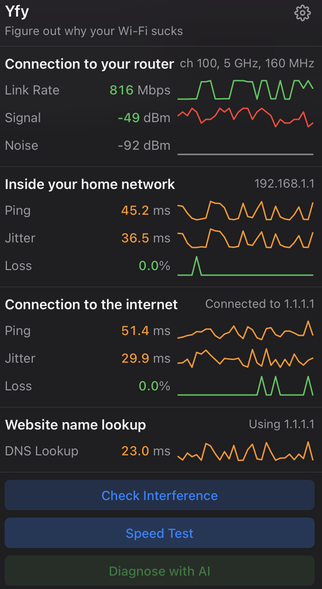

# Yfy

*Figure out why your Wi-Fi sucks.*

A tiny macOS menu bar app that tells you what's actually going on with your internet connection. No more wondering if it's your router, your ISP, or just the universe conspiring against your video call.



## What it does

Click the menu bar icon and instantly see:

- **Router connection** — Signal strength, link speed, and noise levels
- **Home network** — Ping, jitter, and packet loss to your router
- **Internet connection** — Same metrics, but to the actual internet (1.1.1.1)
- **DNS lookups** — How fast your domain names resolve
- **Live graphs** — Watch your connection quality over time
- **Interference check** — Find out if your neighbors' Wi-Fi is fighting with yours
- **Speed test** — Because sometimes you just need to know
- **AI diagnosis** — Get personalized recommendations to fix your Wi-Fi issues (requires OpenAI API key)

Everything is color-coded: green is good, yellow is meh, red is why-is-this-happening.

## Install

```bash
brew tap itsnauman/yfy
brew install yfy
```

Then either symlink to Applications:
```bash
ln -sf $(brew --prefix)/opt/yfy/yfy.app /Applications/yfy.app
```

Or open directly:
```bash
open $(brew --prefix)/opt/yfy/yfy.app
```

## Usage

1. Launch Yfy
2. Click the icon in your menu bar
3. Understand your Wi-Fi situation
4. Press `Esc` to close, or just click away

## AI Diagnosis

Yfy can analyze your network data and provide personalized recommendations using OpenAI's API.

**Setup:**
1. Get an API key from [platform.openai.com](https://platform.openai.com/api-keys)
2. Open Yfy and click the settings icon (⚙️)
3. Paste your API key and save

**What you get:**
- Overall network health assessment
- Identification of specific issues (high/medium/low severity)
- Actionable recommendations prioritized by impact

The AI analyzes signal strength trends, latency patterns, packet loss, interference levels, and speed test results to give you targeted advice like "Move your router away from the microwave" rather than generic tips.

Your API key is stored locally on your device and is only used to communicate with OpenAI.

## License

MIT. Free as in beer, free as in speech.

---

*100% of this code was written by [Claude Code](https://claude.ai/download) with Opus 4.5.*
